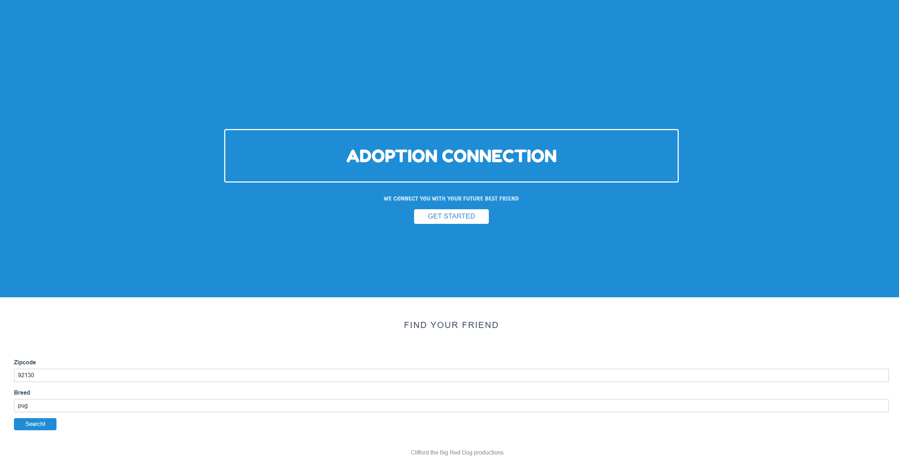
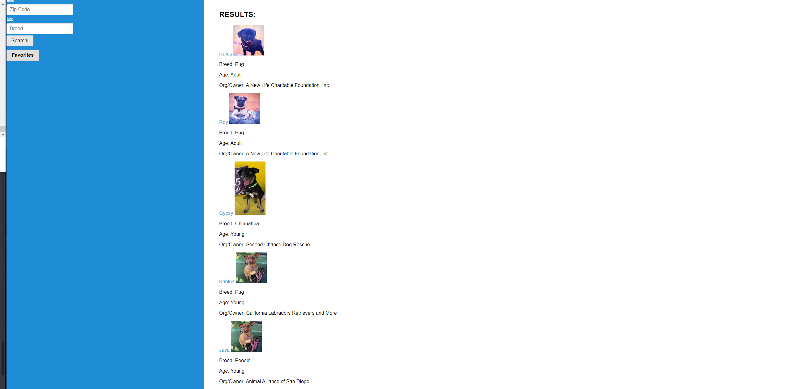
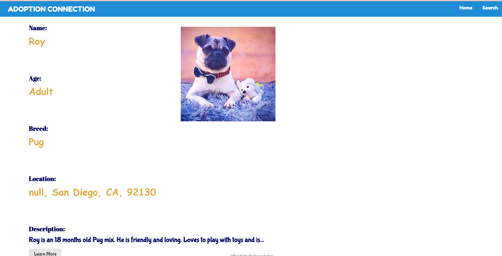

# Adoption-Connection
## Description
Adoption Connection is based on the idea to quickly find dogs that are up for adoption within a certain area. Our motivations stem from one our team mate's, Ivo, mother wants to adopt a dog but does not know where to start. Our solution is our app. It starts with a simple search for zipcode and then type of breed the user is looking for. This will being the user to the next page with results showing dogs within the parameters. If the user likes a certain dog, they then can click on the dog which brings them to their profile for a closer look.

App- https://reeeeeahn.github.io/adoption-connection/

github - https://github.com/rEEEEEahn/adoption-connection

## Table of Contents (Optional)
If your README is long, add a table of contents to make it easy for users to find what they need.
- [Installation](#installation)
- [Usage](#usage)
- [Credits](#credits)
- [License](#license)
- [features](#features)
## Installation
As a team we started with a wireframe, laying out what will happen at each page and what functions need to happen to achieve this. We split up the app work by sections.
    Ryan - HTM L& CSS for homepage and profile page
    Jesse - HTML & CSS for search results page
    Ivo - Javascript and petfinder API
    Justin- Google maps Intergration

Spliting the work in this fashion gave us a few blockers because if the html is not done on a certain page, then other team mates were not able to start or continue their work. Another issue we had was Wireframing. We did not achieve specifics on the wireframing the first time doing it. This resulted in difficulty with placement. 

We also used Kanban to help visualize new issues with the app

Github was new for everone in the group as well; figuring  out how to create branches and merge within a group. 

## Usage

## Credits
Ryan-    https://github.com/rEEEEEahn

Justin-  https://github.com/stan1651

Jesse-   https://github.com/jmoniz155

Ivo-     https://github.com/Ivo-Gatzinski

Pure CSS-https://purecss.io/

PetFinder API-  https://www.petfinder.com/developers/v2/docs/

Google Maps API-https://developers.google.com/maps/documentation/javascript/overview

## License
Copyright (c) [2021] [CLIFORD THE BIG RED DOG]

Permission is hereby granted, free of charge, to any person obtaining a copy
of this software and associated documentation files (the "Software"), to deal
in the Software without restriction, including without limitation the rights
to use, copy, modify, merge, publish, distribute, sublicense, and/or sell
copies of the Software, and to permit persons to whom the Software is
furnished to do so, subject to the following conditions:

The above copyright notice and this permission notice shall be included in all
copies or substantial portions of the Software.

THE SOFTWARE IS PROVIDED "AS IS", WITHOUT WARRANTY OF ANY KIND, EXPRESS OR
IMPLIED, INCLUDING BUT NOT LIMITED TO THE WARRANTIES OF MERCHANTABILITY,
FITNESS FOR A PARTICULAR PURPOSE AND NONINFRINGEMENT. IN NO EVENT SHALL THE
AUTHORS OR COPYRIGHT HOLDERS BE LIABLE FOR ANY CLAIM, DAMAGES OR OTHER
LIABILITY, WHETHER IN AN ACTION OF CONTRACT, TORT OR OTHERWISE, ARISING FROM,
OUT OF OR IN CONNECTION WITH THE SOFTWARE OR THE USE OR OTHER DEALINGS IN THE
SOFTWARE.

## Features
GIVEN a dog search form
THEN I can choose my location. 

WHEN I click submit
THEN I see a list of dogs pertaining to my search parameters.

WHEN I click on the bookmark/save button
THEN I am able to save the dogs that interest me to view later.

WHEN I click on the dog that I am interested in
THEN I am brought to a new page with the dog summary with google maps.

WHEN i click on the ADOPT ME button
THEN i am brought to the adoption website

WHEN I click on the google maps
THEN I am shown the location of the dog

